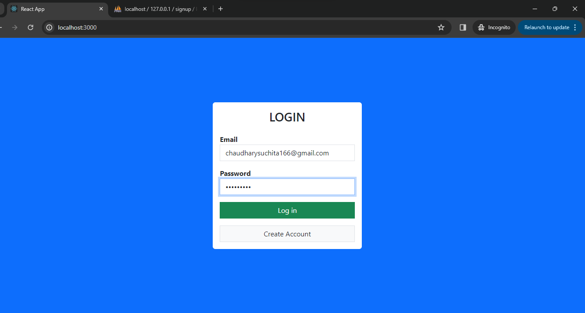
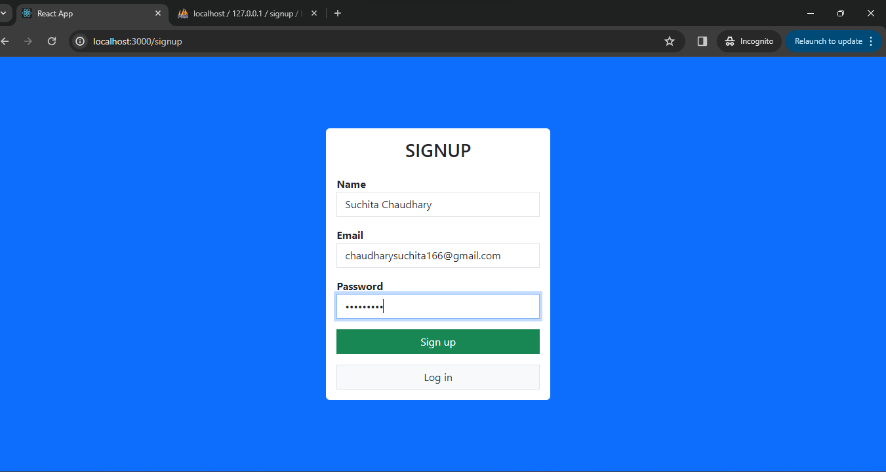
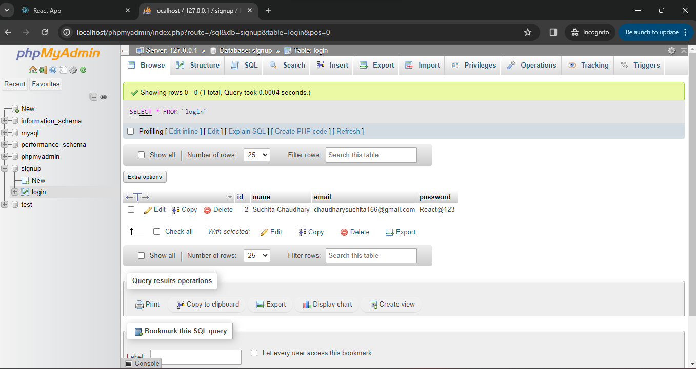
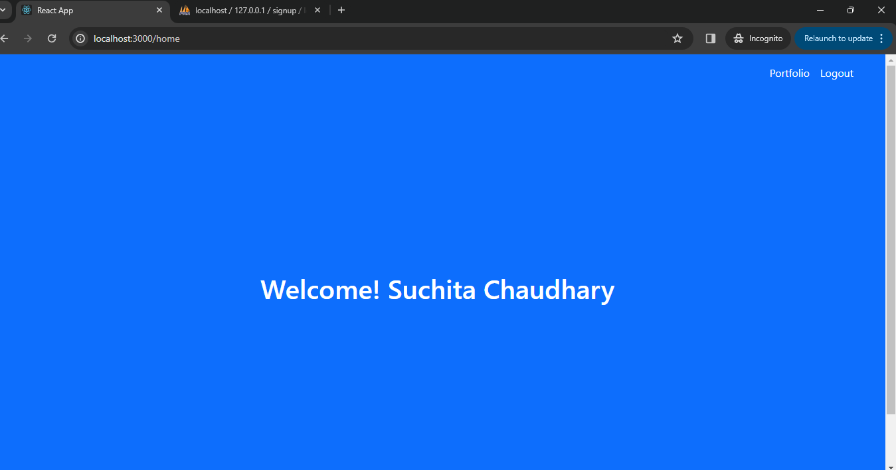

# React Basic React App
This is Basic React Application using  ReactJs, NodeJs and MySQL.

## Project Folder
<ol>
 <li> frontend </li>
 <li> backend </li>
</ol>

## Steps to run the application
1- Please run below commands under both project folders i.e frontend and backend  
<ul>
 <li> npm i</li>
 <li> npm start </li>
</ul>
  
2- Import the signup.sql file into the mysql database  

# ScreenShots

  
  
  
  

